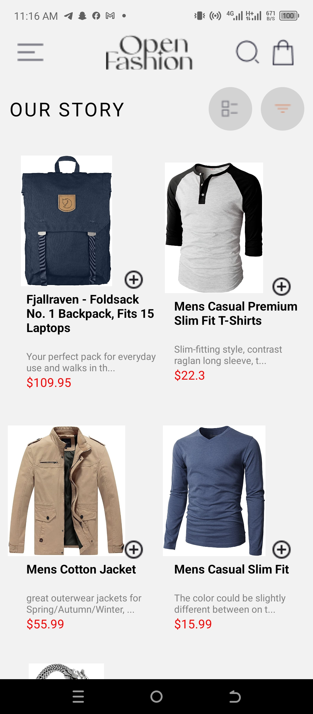
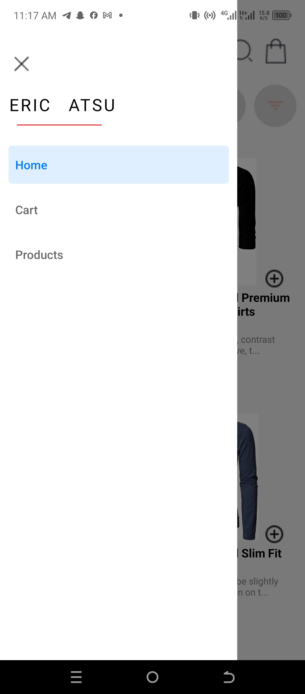
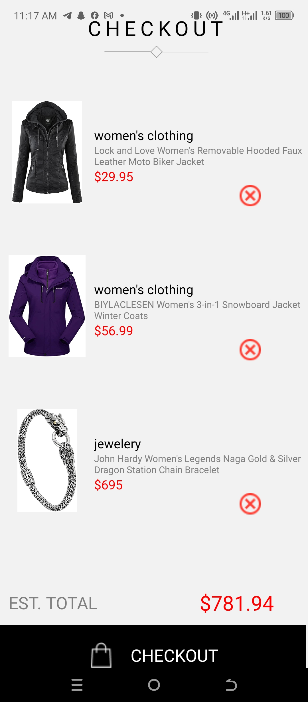
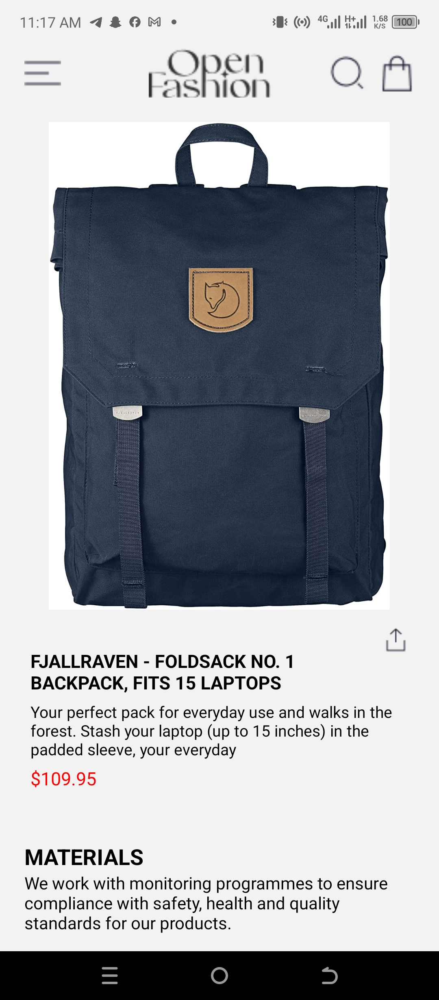
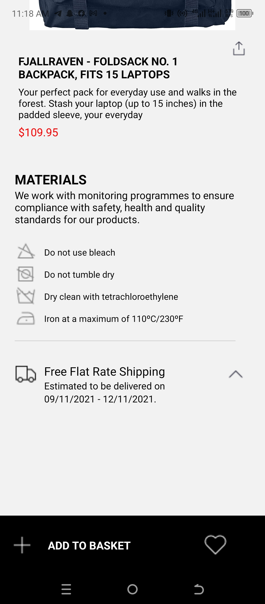

# rn-assignment7-11019735

## Student ID : 11019735

# Description of Design

### . Created a home screen where available products can be viewed. These available products are fetched from an external api using axios.

### . Created a context which shares the cart data and allows to render available products in the home screen as well as add products to the cart.

### . Created a cart screen which helps view the products that have been added to cart. It makes provision for the removal of items from the cart.

### . Created a product details screen which allows the viewing of details about a product that is selected from the home screen.

### . Employed the drawer navigator to move between the home screen,the cart screen and the product details screen with the home screen as the initial screen.

### . In the cart screen, there is a message which is displayed when no item is added to the cart. When an item is added, the item is displayed and the estimated total is also calculated accordingly.

### . The cart data was stored locally on the device using the async storage and it ensures that the stored data persists even when the app is closed and reopened.

# Screenshots

